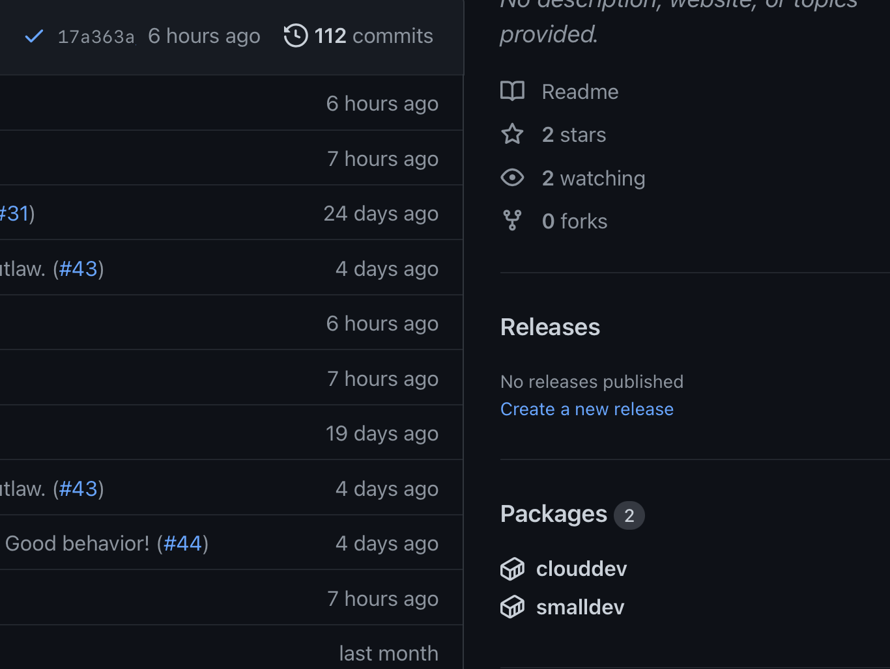

# The cloud is ephemeral and full of horrors. To grasp at water vapor. Futility! Despair!

**Cloud setup issues that should be eventually solved:** See the [issue here](https://github.com/Confirm-Solutions/confirmasaurus/issues/52).

## Our Docker images

We have three docker images at the moment:

- `smalldev` - this is a minimal docker image for developing our Python/C++/JAX/CUDA codebase. All our tests should pass and you should be able to 80% of development tasks.
- `clouddev` - this is a very small image that has docker installed _inside_ the image. It also includes terraform and the AWS CLI. It's useful if you want to do some docker/cloud infrastructure work on a remote machine.
- `bigdev` - this is a much larger docker image. The set up focuses on anything you could possibly want when using our repo.
  - Conda environment: a conda environment including all our standard tools.
  - Other python stuff: VSCode extensions, Jupyter, all our dependencies, linting, formatting, debugging, pytest.
  - C++: linting, formatting (using clang format), compilation and debugging integrated into the IDE.
  - R: handles R markdown documents, [also Jupyter with R](https://stackoverflow.com/a/67320274/3817027), r-inla, debugging, etc. Actually a pretty nice R development experience.
  - Latex and markdown and a lot more.
  - Sagemath

There are subfolders in the [cloud folder](./) for each of these images that include the [Dockerfile](./smalldev/Dockerfile). Some of the subfolders have `./build` and `./test` scripts that run the build and check that the expected capabilities are available.

Then, there are [`.devcontainer.json`](../.devcontainer/devcontainer.json) as well for each of these images. This allows you to launch the images in either Codespaces or the VSCode Remote-Containers extension.

The `smalldev` and `clouddev` images are stored in ghcr.io, the GitHub container registry. You can find these on the right side of the repo dashboard in the "packages" section. [The Github action here](../.github/workflows/docker-publish.yml) builds the images on any PR that changes the relevant configuration and builds and pushes the images on any commit to `main` that affects the images.

IMPORTANT: both the images in ghcr.io are stored in fully public package repositories!! Don't put sensitive info in these images. This should be 100% fine since there's absolutely nothing interesting in these images and should never be anything interesting since they just contain our non-Confirm dependencies. But this warning is here since it would be bad to add some secret keys or IP to an image.



## Using GitHub Codespaces with the confirmasaurus repo

To start using Codespaces, follow along with the [quick start](https://docs.github.com/en/codespaces/getting-started/quickstart) but just use our repo instead of the example repo. For the moment, I strongly recommend using the GPU configuration since it's free while the beta program is still ongoing. Also, they're really fast! 6 cores, 112G RAM, 1 NVidia V100 GPU.

The dev environment should be set up quite cleanly. By default, the `smalldev` devcontainer/docker image will be launched, but in the advanced codespaces launch configuration, you should be able to select either of the other two devcontainers. If you select the `bigdev` devcontainer, the build time will be very long. The other two images should have very fast builds because the images are stored on GHCR.

After you've set up your codespace, all the steps in the [main README's "Getting set up"](../README.md#getting-set-up) above will have already been done for you! There's no setup left to do. Just code and enjoy.

For personal customizations, you get to do a few things. These are not mutually exclusive and allow configuring different components of your environment.

- you can either run the browser-based VSCode that is the Codespaces default or you can connect to the remote machine from your local VSCode app. I much prefer connecting with my local app but I haven't tried the browser version very much!
- you can use [VSCode Settings Sync](https://docs.github.com/en/codespaces/customizing-your-codespace/personalizing-github-codespaces-for-your-account#settings-sync) (you sign in to your github account) to sync settings VSCode settings, keybindings and extensions between local machine and codespace. This is nice and I strongly recommend it!!
- you can create a [dotfiles repo](https://docs.github.com/en/codespaces/customizing-your-codespace/personalizing-github-codespaces-for-your-account#dotfiles) that the codespace will clone and copy in automatically. These will set up your terminal development environment including things like your bash/zsh configuration, any tools you would like to install with tools like `apt` and any other configuration/installation that you want to automate. I have everything set up so that the environment/tools are essentially indistinguishable from my local machine. This is really nice and I really strongly recommend this if you're going to be using Codespaces or Remote-Containers much!

I am happy to share my dotfiles and VSCode settings if you'd like. To share the dotfiles, I'll need to scrub out some passwords first, but that's probably an improvement anyway. :embarrassed:

## Getting started launching AWS infra

Installing and configuring your tools:

1. Get the AWS login info and the AWS private key from Ben. Try the AWS login info and go look at the EC2 console. Put the private key it in your `.ssh/` folder and call it `aws-key-pair.pem` and then run `chmod 400 ~/.ssh/aws-key-pair.pem; ssh-add ~/.ssh/aws-key-pair.pem`. The `chmod` command sets the key to be read-only for your user and inaccessible to other users.
2. [Install the AWS CLI](https://aws.amazon.com/cli/).
3. Get the `AWS_ACCESS_KEY_ID` and from the ["Security Credentials" dropdown on the upper right corner of the AWS dashboard](https://us-east-1.console.aws.amazon.com/iam/home?region=us-east-1#/security_credentials). Get the `AWS_SECRET_ACCESS_KEY` from Ben. Then run `aws configure` and set the key, key id and region. (Note: I've used `us-east-1` as the region. Some things might require extra setup in other regions? I'm not sure.)
4. [Install `terraform` from this link.](https://learn.hashicorp.com/tutorials/terraform/install-cli)
5. [Install docker locally from this link.](https://docs.docker.com/engine/install/)

Actually launching some infrastructure-as-code.

1. Go into the `cloud/` folder (everything terraform-related will probably need to be run from this folder).
2. Run `terraform init`. This will initialize your terraform state. Terraform will track the state of remote resources.
3. Then, `terraform workspace new name_your_workspace`. This will create a private workspace so that your resources don't have name conflicts with other folks.
4. Then, `terraform apply`. This launches the EC2 instance and supporting infra. Go take a look at the AWS console and see your instance. The instance will automatically install docker as specified by `main.tf` and `init_amzn_linux.sh`.
5. From the `cloud/` folder and run `./connect.sh`. This simple script grabs the public DNS/IP of the EC2 instance and then connects to it using ssh-agent forwarding so that all your local ssh keys are still available. Agent forwarding is useful for GitHub access and AWS CLI access.
6. Congratulations, you've launched an EC2 instance! At this point, you can either destroy the instance or go to another section and make use of the instance.
7. Run `terraform destroy` to destroy your instance and supporting infrastructure.

## Using VSCode Remote-Containers

I recommend this as the first point of attack for running on AWS. In the future, we should jobs as individual ephemeral docker containers on something like AWS Elastic Container Service, but this is a starting point. Install:

1. [Install the VSCode Remote extension pack.](https://marketplace.visualstudio.com/items?itemName=ms-vscode-remote.vscode-remote-extensionpack)
2. And the [VSCode Docker extension](https://code.visualstudio.com/docs/containers/overview)

Then, to run:

3. The rest of this section assumes that you have already launched an EC2 instance using `terraform apply` as explained above.
4. Next, run the `./setup_remotedev.sh` script. This sets the remote EC2 instance as your docker context. Now all docker commands will be running remotely!! The script will also log in to ghcr.io on the instance. For this to work correctly, you need to have the `$GITHUB_TOKEN` and `$GITHUB_USER` environment variables set. [Follow the directions here to create a `$GITHUB_TOKEN` personal access token (PAT) if you haven't before.](https://docs.github.com/en/authentication/keeping-your-account-and-data-secure/creating-a-personal-access-token) Finally, the script will pull the `smalldev` docker image.
5. Now, we're going to set up the remote machine as a devcontainer using the **Remote-Containers extension**. Run the VSCode command "Remote-Containers: Clone Repository in Container Volume...". Then, select the Github repo you want to use: `Confirm-Solutions/confirmasaurus`.
6. This will launch the `smalldev` devcontainer/docker image and after a minute or two of building the container, you'll be dropped into a lovely development environment!
7. When you're done, close the VSCode window, then `terraform destroy` if you want to delete the infrastructure. Alternatively, you can `aws ec2 stop-instances --instance-ids $( terraform output --raw id )` to stop the running instance. Later the same command but with `start-instances` instead of `stop-instances` will work to restart the instance. (note: the `terraform destroy` seems to take a long time for some P instances!)

TL;DR:

```
## Launch your infrastructure and set up your connection:
cd cloud
terraform init
terraform workspace new name_your_workspace
terraform apply
# STOP and wait about two minutes for the docker install on the EC2 instance to
# complete
./setup_remotedev.sh
# Connect with VSCode Remote Containers...
# Destroy your infrastructure!
terraform destroy
docker context use default
```

## Launching a non-interactive job

TODO: I think this is one of the remaining important tasks here. See the [issue here](https://github.com/Confirm-Solutions/confirmasaurus/issues/52).

## Notes

**Cloning from GitHub from an EC2 instance:**

- connect without agent forwarding and just login with a github token manually with https.
- use ssh-agent forwarding with `ssh -A` to share your local ssh keys with the remote machine.

**Pulling from AWS ECR from an EC2 instance:**

- this should work by default because the terraform configuration sets up an IAM role and policy for the EC2 instance that has full access to both EC2 and ECR.
- See the [iampolicy.json](iampolicy.json) file.

**Installing dotfiles:**

- This can be done automatically on Codespaces by specifying your dotfiles repo in GitHub settings.
- Also, doable automatically foR VSCode Remote-Containers by specifying your dotfiles repo in VSCode settings.
- Or, you can do it manually with something like: `sh -c "$(curl -fsLS https://chezmoi.io/get)" -- init --ssh --apply tbenthompson`

**Building docker images on Mac M1:**

- this is troublesome because, by default, images are built for an `aarch64` architecture. This is not good if we want to later run an image on a x86_64 cloud instance.
- My favorite solution is to just not build on the local machine and instead build on the EC2 instance. If you've set up the remote machine as a `docker context`, then all your docker build command will just be running remotely!
- Or, you can build a multi-architecture image using something like `docker buildx build --platform linux/amd64,linux/arm64 -t company/image_name .`
- Or, you can build images in the `clouddev` devcontainer/docker image.

**Handy tools:**

- the Docker extension and "Remote Explorer" panels in VSCode are very helpful. Explore them!
- Run "close remote connection" to end the session
- to reconnect: in the docker panel, start the container, then "attach to running container", then open an existing folder.
- `terraform -install-autocomplete` will install terraform autocompletion into your shell.

**Accessing AWS from Codespaces:**

- why would you want to do this? I'm not totally sure, but maybe if your local work environment is messed up, this could be a quick way to get working. I tried this at one point because I thought my local setup was broken.
- you need to get your AWS_ACCESS_KEY_ID and AWS_SECRET_ACCESS_KEY into your codespace. In addition, you need to get the private key being used for EC2 access into the Codespaces. All these things should be added as Codespaces secrets following the [directions here](https://docs.github.com/en/codespaces/managing-your-codespaces/managing-encrypted-secrets-for-your-codespaces).
- You can install the AWS CLI v2 by running:
  ```
  curl "https://awscli.amazonaws.com/awscli-exe-linux-x86_64.zip" -o "awscliv2.zip"
  unzip awscliv2.zip
  sudo ./aws/install -i /usr/local/aws-cli -b /usr/local/bin
  ```
