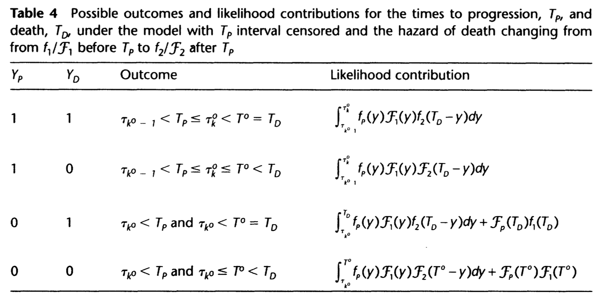

---
jupyter:
  jupytext:
    text_representation:
      extension: .md
      format_name: markdown
      format_version: '1.3'
      jupytext_version: 1.14.1
  kernelspec:
    display_name: Python 3.9.12 ('imprint')
    language: python
    name: python3
---

# Thall et al 2005

Following the modeling in 

Thall, Peter F, Leiko H Wooten, and Nizar M Tannir. “Monitoring Event Times in Early Phase Clinical Trials: Some Practical Issues.” Clinical Trials 2, no. 6 (December 2005): 467–78. https://doi.org/10.1191/1740774505cn121oa.

I also found the notes here to be useful for learning about survival analysis. Before writing this document, I had zero prior survival analysis experience: https://web.stanford.edu/~lutian/coursepdf/slideweek1.pdf 

## Section 1: "A simple trial design for the Xeloda + Gemzar trial".

### Data model

Time to treatment failure: $T = \min(T_P, T_D)$ where $T_P$ is time to progression and $T_D$ is time to death.

assume $T$ is exponentially distributed:
\begin{align}
p(t | \mu) = \exp(-t / \mu) / \mu
\end{align}

or alternatively, in terms of the event rate parameter $\lambda$, because $\mu = 1 / \lambda$:
\begin{align}
p(t | \lambda) =  \lambda \exp(-t\lambda)
\end{align}

It's also possible to parameterize in terms of the median: $\tilde{\mu} = \mathrm{median}(T) = \log(2) \mu$. 

### Prior

We assume $\mu$ follows an inverse gamma prior:

\begin{align}
p(\mu|a, b) = \exp(-b / \mu) b^a \mu^{-(a + 1)} / \Gamma(a)
\end{align}

Note that this equivalent to assuming a gamma prior for $\lambda$. Also, Thall sometimes discusses parameterization of the prior in terms of the median time to treatment failure which just involves multiplying by $\log(2)$ as above.

Importantly, this is a conjugate prior.

### Other notation.

Variables subscripted with $S$ are referring to the standard therapy while those subscripted with $E$ refer to the experimental therapy.

```python
import sys

sys.path.append("../imprint/research/berry/")
import berrylib.util as util

util.setup_nb()
```

```python
import scipy.stats
import numpy as np
import matplotlib.pyplot as plt
```

```python
med_E_true = 7
mean_E_true = 7 / np.log(2)
mean_E_true

N = 1000
samples = scipy.stats.expon.rvs(scale=mean_E_true, size=N)
t = np.linspace(0, 50, 1000)
pdf = scipy.stats.expon.pdf(t, scale=mean_E_true)
bins = np.linspace(0, 50, 21)
plt.hist(samples, bins=bins, density=True)
plt.plot(t, pdf)
plt.show()
```

We will take 6 new patients into the trial each month for 14 months, observing the patients for 

```python
n_months = 14
n_samples = 14 * 6
seed = 10
np.random.seed(seed)
ttf = scipy.stats.expon.rvs(scale=mean_E_true, size=n_samples)
start_date = np.repeat(np.arange(14), 6)
failure_date = start_date + ttf
Y = failure_date > n_months
T = np.minimum(failure_date, n_months) - start_date
```

```python
a = 5.348
b = 30.161

t = np.linspace(0, 50, 1000)
pdf = scipy.stats.invgamma.pdf(t, a, scale=b)
plt.plot(t, pdf)
plt.show()
print("prior mean", scipy.stats.invgamma.mean(a, scale=b))
```

### Version 1: Conjugate prior

```python
a = 5.348
b = 30.161

a_post = a + Y.sum()
b_post = b + T.sum()
t = np.linspace(0, 50, 1000)
pdf = scipy.stats.invgamma.pdf(t, a_post, scale=b_post)
plt.plot(t, pdf)
plt.show()
exact_mean = scipy.stats.invgamma.mean(a_post, scale=b_post)
print("posterior mean", exact_mean)
```

### Version 2: MCMC

```python
import numpyro
import numpyro.distributions as dist
import numpyro.infer

import jax
import jax.numpy as jnp

from jax.config import config

# This line is critical for enabling 64-bit floats.
config.update("jax_enable_x64", True)
```

```python
class CensoredExponential(dist.Distribution):
    def __init__(self, hazard, n_samples, start_dates, validate_args=None):
        self.hazard = hazard
        self.n_samples = n_samples
        self.start_dates = start_dates
        self.expon = dist.Exponential(self.hazard)
        super(CensoredExponential, self).__init__(
            batch_shape=jnp.shape(hazard), validate_args=validate_args
        )

    def sample(self, key):
        ttf = self.expon.sample(key, sample_shape=(self.n_samples,))
        failure_date = ttf + self.start_dates
        failure_date > n_months

    def log_prob(self, YT):
        return jnp.sum(
            jnp.where(
                YT[:, 0],
                self.expon.log_prob(YT[:, 1]),
                -YT[:, 1] * self.hazard,
            )
        )
```

```python
def sample(YT):
    mean_ttf = numpyro.sample("mu", dist.InverseGamma(a, b))
    hazard = numpyro.deterministic("lambda", 1.0 / mean_ttf)
    numpyro.sample("YT", CensoredExponential(hazard, n_samples, start_date), obs=YT)


seed = 10
n_samples = 100000
nuts_kernel = numpyro.infer.NUTS(sample)
mcmc = numpyro.infer.MCMC(
    nuts_kernel,
    progress_bar=False,
    num_warmup=100,
    num_samples=n_samples,
)
rng_key = jax.random.PRNGKey(seed)
YT = np.stack((Y, T), axis=-1)
mcmc.run(rng_key, YT)
```

```python
mu_samples = mcmc.get_samples()["mu"].to_py()
plt.hist(mu_samples)
plt.show()
mcmc_mean = mu_samples.mean()
print("mcmc mean", mcmc_mean)
print("mcmc pct err", 100 * np.abs(mcmc_mean - exact_mean) / exact_mean)
```

### Version 3: Integration

```python
mean_ttf_qr = util.gauss_rule(50, a=0, b=30)
log_prior = scipy.stats.invgamma.logpdf(mean_ttf_qr.pts, a, scale=b)
log_prior
```

```python
# check that we're integrating over a sufficiently wide domain.
scipy.stats.invgamma.cdf(mean_ttf_qr.pts[-1], a, scale=b)
```

```python
n_failures = YT[:, 0].sum()
total_obs_time = YT[:, 1].sum()


def log_likelihood(mean_ttf):
    return -n_failures * np.log(mean_ttf) + -total_obs_time / mean_ttf
```

```python
logpdf = log_prior + log_likelihood(mean_ttf_qr.pts)
pdf = np.exp(logpdf)
pdf /= np.sum(pdf * mean_ttf_qr.wts)
```

```python
plt.plot(mean_ttf_qr.pts, pdf)
plt.show()
```

```python
integral_mean = np.sum(mean_ttf_qr.pts * pdf * mean_ttf_qr.wts)
print("integral mean", integral_mean)
print("integral pct err", 100 * np.abs(integral_mean - exact_mean) / exact_mean)
```

### Version 4: INLA-ish

This is degenerate in the sense that there is no hyperparameter. So, we just approximate the prior with a normal distribution.

```python
t = np.linspace(0.001, 50, 1000)
invt = 1.0 / t
a_g = a / b
b_g = a / (b**2)
pdf2 = scipy.stats.invgamma.pdf(t, a, scale=b)
pdf3 = (
    jnp.exp(-b / t) * (b**a) * (t ** -(a + 1)) / jnp.exp(jax.scipy.special.gammaln(a))
)

plt.plot(t, pdf2, "k-")
plt.plot(t, pdf3, "r-")
plt.show()
```

```python
# n_failures = YT[:,0].sum()
# total_obs_time = YT[:,1].sum()
# def log_likelihood(mean_ttf):
#     return -n_failures * np.log(mean_ttf) + -total_obs_time / mean_ttf
def log_joint(mean_ttf):
    log_prior = (
        -b / mean_ttf
        + a * jnp.log(b)
        - (a + 1) * jnp.log(mean_ttf)
        - jax.scipy.special.gammaln(a)
    )
    log_likelihood = -n_failures * jnp.log(mean_ttf) + -total_obs_time / mean_ttf
    return log_prior + log_likelihood


log_joint(jnp.linspace(5, 15, 11))
```

```python
grad_fnc = jax.grad(log_joint)
hess_fnc = jax.hessian(log_joint)
```

```python
tff_max = 1.0
tol = 1e-4
for i in range(100):
    grad = grad_fnc(tff_max)
    hess = hess_fnc(tff_max)
    step = -grad / hess
    tff_max += step
    if np.abs(step) < tol:
        break
print(f"soln={tff_max} took iters={i}")
```

```python
log_joint(tff_max)
```

```python
tff_max, hess
```

```python
std_dev = np.sqrt(-1.0 / hess)
t = np.linspace(0, 50, 1000)
pdf = scipy.stats.invgamma.pdf(t, a_post, scale=b_post)
plt.plot(t, pdf, "r-", label="exact")
plt.plot(t, scipy.stats.norm.pdf(t, tff_max, scale=std_dev), "b-", label="gaussian")
plt.xlim([4, 16])
plt.xlabel("$\mu$")
plt.ylabel("$\mathrm{p}(\mu | y)$")
plt.legend()
plt.title("pdf of average time to either cancer progression or death")
plt.show()
```

The result above might be improved with a skew-normal "simplified laplace approximation" from section 3.2.3 in Rue et al 2009.

```python

```

```python
skew = jax.grad(hess_fnc)(tff_max)
skew
```

## Section 2: Interval censoring

```python
import sys

sys.path.append("../imprint/research/berry/")
import berrylib.util as util

util.setup_nb()
```

```python
import numpy as np
import scipy.stats
import matplotlib.pyplot as plt
import numpyro
import numpyro.distributions as dist
import numpyro.infer

import jax
import jax.numpy as jnp

from jax.config import config

# This line is critical for enabling 64-bit floats.
config.update("jax_enable_x64", True)
```

```python
n_patients = 14 * 6
max_n_months = 14
evaluation_period = 2


def simulate_dataset(seed, mean_ED_true, mean_EP_true):
    np.random.seed(seed)
    ttfP = scipy.stats.expon.rvs(scale=mean_EP_true, size=n_patients)
    ttfD = scipy.stats.expon.rvs(scale=mean_ED_true, size=n_patients)
    start_date = np.linspace(0, 14, n_patients)
    P_date = start_date + ttfP
    D_date = start_date + ttfD
    return np.stack((start_date, D_date, P_date), axis=-1)


def sufficient_stats(data, n_months):
    start_date, D_date, P_date = data.T

    evaluation_dates = (
        start_date[:, None]
        + (evaluation_period * np.arange(max_n_months // 2 + 1))[None, :]
    )
    Y_da = D_date <= n_months

    # Only include evaluations that are within the time frame of the trial.
    include_eval = evaluation_dates <= n_months
    # For each patient and each time period, did we observe a progression?
    progress = (
        (evaluation_dates[:, :-1] < P_date[:, None])
        & (P_date[:, None] < evaluation_dates[:, 1:])
        & (evaluation_dates[:, 1:] < D_date[:, None])
        & include_eval[:, 1:]
    )
    Y_p = np.any(progress, axis=1)

    tau_k0 = np.empty(data.shape[0])
    tau_k0[Y_p] = evaluation_dates[:, 1:][progress]

    # This is some ugly code that figures out when the last observation of a patient was.
    last_observation_idx = (
        np.argmin(
            (evaluation_dates <= n_months) & (evaluation_dates < D_date[:, None]),
            axis=1,
        )
        - 1
    )
    tau_k0[~Y_p] = (
        evaluation_dates[np.arange(evaluation_dates.shape[0]), last_observation_idx]
    )[~Y_p]
    tau_k0 -= start_date

    T0 = np.minimum(D_date, n_months) - start_date

    data = np.stack((Y_p, tau_k0, Y_da, T0), axis=-1)
    return data
```

```python
mean_EP_true = 6 / np.log(2)
mean_ED_true = 12 / np.log(2)
raw_data = simulate_dataset(10, mean_ED_true, mean_EP_true)
data = sufficient_stats(raw_data, max_n_months)
```

```python
# Check that we never have progression after death
prog_after_death = (data[:, 0].astype(bool) & data[:, 2].astype(bool)) & (
    data[:, 1] >= data[:, 3]
)
assert np.all(~prog_after_death)
```

```python
# Check that last progression observation date is never after death
assert np.all(data[:, 1] <= data[:, 3])
```

```python
data[:, 0].astype(bool) & (data[:, 1] < 2)
```

```python
def survivor_fnc(x, ttf):
    return 1.0 - scipy.stats.expon.cdf(x, scale=ttf)


def log_likelihood_explicit(data, ttf_da, ttf_p):
    Y_p, tau_k0, Y_da, T0 = data.T
    death_term = np.where(
        Y_da, scipy.stats.expon.pdf(T0, scale=ttf_da), survivor_fnc(T0, ttf_da)
    )
    pi_k0 = survivor_fnc(tau_k0 - evaluation_period, ttf_p) - survivor_fnc(
        tau_k0, ttf_p
    )
    progression_term = np.where(Y_p, pi_k0, survivor_fnc(tau_k0, ttf_p))
    return np.sum(np.log(death_term) + np.log(progression_term))


def log_likelihood(data, ttf_da, ttf_p):
    Y_p, tau_k0, Y_da, T0 = data.T
    N_da = Y_da.sum()
    T_p = (tau_k0 * (1 - Y_p)).sum()
    T_da = T0.sum()
    death_term = -N_da * np.log(ttf_da) + -T_da / ttf_da
    progression_term = -T_p / ttf_p + np.sum(
        np.log(np.exp(-(tau_k0 - evaluation_period) / ttf_p) - np.exp(-tau_k0 / ttf_p))
        * Y_p
    )
    return death_term + progression_term


log_likelihood(data, mean_ED_true, mean_EP_true), log_likelihood_explicit(
    data, mean_ED_true, mean_EP_true
)
```

```python
class IntervalCensored(dist.Distribution):
    def __init__(self, mu_da, mu_p, validate_args=None):
        self.mu_da = mu_da
        self.mu_p = mu_p
        super(IntervalCensored, self).__init__(
            batch_shape=jnp.shape(mu_p), validate_args=validate_args
        )

    def sample(self, key):
        raise NotImplementedError()

    def log_prob(self, data):
        Y_p, tau_k0, Y_da, T0 = data.T
        N_da = Y_da.sum()
        T_p = (tau_k0 * (1 - Y_p)).sum()
        T_da = T0.sum()
        death_term = -N_da * jnp.log(self.mu_da) + -T_da / self.mu_da
        progression_term = -T_p / self.mu_p + jnp.sum(
            jnp.log(
                jnp.exp(-(tau_k0 - evaluation_period) / self.mu_p)
                - jnp.exp(-tau_k0 / self.mu_p)
            )
            * Y_p
        )
        return death_term + progression_term
```

```python
IntervalCensored(mean_ED_true, mean_EP_true).log_prob(data)
```

```python
a_Sp, b_Sp = 20.391, 195.826
a_Sda, b_Sda = 95.401, 1303.670
a_Ep, b_Ep = 2.039, 19.583
a_Eda, b_Eda = 9.540, 130.367


def sample(data):
    numpyro.sample("mu_Sp", dist.InverseGamma(a_Sp, b_Sp))
    numpyro.sample("mu_Sda", dist.InverseGamma(a_Sda, b_Sda))
    mean_ttf_Ep = numpyro.sample("mu_Ep", dist.InverseGamma(a_Ep, b_Ep))
    mean_ttf_Eda = numpyro.sample("mu_Eda", dist.InverseGamma(a_Eda, b_Eda))
    numpyro.sample("data", IntervalCensored(mean_ttf_Eda, mean_ttf_Ep), obs=data)


seed = 10
n_samples = 10000
nuts_kernel = numpyro.infer.NUTS(sample)
mcmc = numpyro.infer.MCMC(
    nuts_kernel,
    progress_bar=False,
    num_warmup=100,
    num_samples=n_samples,
)
rng_key = jax.random.PRNGKey(seed)
mcmc.run(rng_key, data)
```

```python
mu_p_samples = mcmc.get_samples()["mu_Ep"].to_py()
plt.title("mean time to progression posterior")
plt.hist(mu_p_samples, density=True)
plt.show()
mcmc_p_mean = mu_p_samples.mean()
print("mcmc mean ttf progression", mcmc_p_mean)

mu_da_samples = mcmc.get_samples()["mu_Eda"].to_py()
plt.title("mean time to death posterior")
plt.hist(mu_da_samples, density=True)
plt.show()
mcmc_da_mean = mu_da_samples.mean()
print("mcmc mean ttf death", mcmc_da_mean)
```

```python
med_EP_true = 6
med_ED_true = 12
mean_EP_true = med_EP_true / np.log(2)
mean_ED_true = med_ED_true / np.log(2)
print("full ttf", 1.0 / ((1.0 / mean_EP_true) + (1.0 / mean_ED_true)) * np.log(2))
mean_ED_true, mean_EP_true
```

```python
n_samples = 3000
kernel = numpyro.infer.NUTS(sample)
mcmc = numpyro.infer.MCMC(
    kernel,
    progress_bar=False,
    num_warmup=100,
    num_samples=n_samples,
    jit_model_args=True,
)
```

```python
%%time
N_sim = 100
means = np.empty((N_sim, 2))
rng_key = jax.random.PRNGKey(10)
for i in range(N_sim):
    seed = 10 + i
    data_i = sufficient_stats(
        simulate_dataset(seed, mean_ED_true, mean_EP_true), max_n_months
    )
    mcmc.run(rng_key, data_i)

    samples = mcmc.get_samples()
    mcmc_da_mean = samples["mu_Eda"].mean()
    mcmc_p_mean = samples["mu_Ep"].mean()
    means[i, :] = (mcmc_da_mean, mcmc_p_mean)
```

```python
plt.hist(samples["mu_Eda"].to_py(), bins=np.linspace(5, 30, 21), density=True)
plt.show()
```

```python
print("est", means[:, 0].mean(), means[:, 1].mean())
print("true", mean_ED_true, mean_EP_true)
```

```python
mean_EP_true = 6.0 / np.log(2)
mean_ED_true = 12.0 / np.log(2)
# mean_EP_true = 10.0 / np.log(2)
# mean_ED_true = 23.33 / np.log(2)
p_L = 0.019
N_sim = 100
n_patients_early = np.empty(N_sim, dtype=np.int32)
for i in range(N_sim):
    seed = 10 + i
    rawdata_i = simulate_dataset(seed, mean_ED_true, mean_EP_true)
    for t in range(1, n_patients + 1):
        raw_ti = rawdata_i[:t]
        suff_ti = sufficient_stats(raw_ti, raw_ti[-1, 0])
        mcmc.run(rng_key, suff_ti)
        samples = mcmc.get_samples()
        mu_S = 1.0 / (1.0 / samples["mu_Sda"] + 1.0 / samples["mu_Sp"])
        mu_E = 1.0 / (1.0 / samples["mu_Eda"] + 1.0 / samples["mu_Ep"])
        pr_success = jnp.sum(mu_S + 3 < mu_E) / mu_S.shape[0]
        stop = pr_success < p_L
        # print(f'pct chance of success={pr_success * 100:5.2f}% stop={stop}')
        n_patients_early[i] = t
        if stop:
            # print(n_patients_early[i])
            break
```

```python
PET = (N_sim - np.sum(n_patients_early >= 83)) / N_sim
PET
```

```python
np.quantile(n_patients_early, [0.25, 0.5, 0.75])
```

##### What might be wrong here?
The results here do not line up precisely with the modeling in Thall et al 2005.
I'm going to ignore these problems for now since the general drift of the results are consistent with the Thall paper. There are plenty of places in the simulation where I could have small errors like an off-by-one. The precision of the explanation in the Thall paper is not excellent. I'm also only running for 3000 samples in MCMC and only 100 simulations of the trial so there's plenty of room for some of the difference to be random chance. 

**One big missing piece is continuous monitoring.** Currently, the data are only updated at each patient addition, but in fact the posteriors should be updated every time anything happens including a progression or death or patient addition. This would probably shorten the trials on average and might be the main missing piece!!

**One big missing piece is continuous monitoring.**

**One big missing piece is continuous monitoring.**

**One big missing piece is continuous monitoring.**

**One big missing piece is continuous monitoring.**

**One big missing piece is continuous monitoring.**


## Section 3: Accounting for the effect of disease progression on survival

```python
import sys

sys.path.append("../imprint/research/berry/")
import berrylib.util as util

util.setup_nb()
```

```python
import numpy as np
import scipy.stats
import matplotlib.pyplot as plt
import numpyro
import numpyro.distributions as dist
import numpyro.infer

import jax
import jax.numpy as jnp

from jax.config import config

# This line is critical for enabling 64-bit floats.
config.update("jax_enable_x64", True)
```

```python
n_patients = 14 * 6
max_n_months = 14
evaluation_period = 2
```

```python
def simulate_dataset(seed, mu_ep, mu_ed1, mu_ed2, mu_ea):
    np.random.seed(seed)
    ttfP = scipy.stats.expon.rvs(scale=mu_ep, size=n_patients)
    ttfD1 = scipy.stats.expon.rvs(scale=mu_ed1, size=n_patients)
    ttfD2 = scipy.stats.expon.rvs(scale=mu_ed2, size=n_patients)
    ttfA = scipy.stats.expon.rvs(scale=mu_ea, size=n_patients)
    start_date = np.linspace(0, 14, n_patients)
    P_date = start_date + ttfP
    D1_date = start_date + ttfD1
    D2_date = P_date + ttfD2
    D_date = np.where(D1_date > P_date, D2_date, D1_date)
    A_date = start_date + ttfA
    return np.stack((start_date, D_date, P_date, A_date), axis=-1)
```

```python
example_mus = np.array([7, 14, 5.75, 48]) / np.log(2)
rawdata = simulate_dataset(10, *example_mus)
```

```python
def sufficient_stats(data, n_months):
    start_date, D_date, P_date, A_date = data.T

    Y_d = D_date <= n_months

    # Only include evaluations that are within the time frame of the trial.
    evaluation_dates = (
        start_date[:, None]
        + (evaluation_period * np.arange(max_n_months // 2 + 1))[None, :]
    )
    include_eval = evaluation_dates <= n_months
    # For each patient and each time period, did we observe a progression?
    progress = (
        (evaluation_dates[:, :-1] < P_date[:, None])
        & (P_date[:, None] < evaluation_dates[:, 1:])
        & (evaluation_dates[:, 1:] < D_date[:, None])
        & include_eval[:, 1:]
    )
    Y_p = np.any(progress, axis=1)

    tau_k0 = np.empty(data.shape[0])
    tau_k0[Y_p] = evaluation_dates[:, 1:][progress]

    # This is some ugly code that figures out when the last observation of a patient was.
    last_observation_idx = (
        np.argmin(
            (evaluation_dates <= n_months) & (evaluation_dates < D_date[:, None]),
            axis=1,
        )
        - 1
    )
    tau_k0[~Y_p] = (
        evaluation_dates[np.arange(evaluation_dates.shape[0]), last_observation_idx]
    )[~Y_p]
    tau_k0 -= start_date

    T0 = np.minimum(D_date, n_months) - start_date

    Y_a = A_date < n_months
    T_a = np.minimum(A_date, n_months) - start_date
    data = np.stack((Y_p, tau_k0, Y_d, T0, Y_a, T_a), axis=-1)
    return data
```

```python
data = sufficient_stats(rawdata, max_n_months)
```

For future reference in terms of understanding the likelihoods here:
* the integrals come in because we don't know the exact time of progression so the time when we flip from $\lambda_1$ to $\lambda_2$ is unknown. 
* the integrals in the third and fourth formulas are there because despite not observing progression, progression might still have happened before death. 
* The non integral terms in the third and fourth formulas are for the situation where death occured before progression.



```python
class PiecewiseInterval(dist.Distribution):
    def __init__(self, mu_d1, mu_d2, mu_p, mu_a, validate_args=None):
        self.mu_d1 = mu_d1
        self.mu_d2 = mu_d2
        self.mu_p = mu_p
        self.mu_a = mu_a
        super(PiecewiseInterval, self).__init__(
            batch_shape=jnp.shape(mu_p), validate_args=validate_args
        )

    def sample(self, key):
        raise NotImplementedError()

    def log_prob(self, data):
        (Y_p, tau_k0, Y_d, T0, Y_a, T_a) = data.T
        ld1 = 1.0 / self.mu_d1
        ld2 = 1.0 / self.mu_d2
        lp = 1.0 / self.mu_p
        la = 1.0 / self.mu_a
        gamma = lp + ld1 - ld2
        prefix = (1.0 / gamma) * lp * ld2**Y_d * jnp.exp(-T0 * ld2)
        pi_k0_P = prefix * (
            jnp.exp(-(tau_k0 - evaluation_period) * gamma) - jnp.exp(-tau_k0 * gamma)
        )
        pi_k0_NP = prefix * (
            jnp.exp(-tau_k0 * gamma) - jnp.exp(-T0 * gamma)
        ) + ld1**Y_d * jnp.exp(-T0 * (lp + ld1))
        a_term = jnp.log(la) * Y_a.sum() + -T_a.sum() * la
        return jnp.sum(Y_p * jnp.log(pi_k0_P) + (1 - Y_p) * jnp.log(pi_k0_NP)) + a_term
```

```python
PiecewiseInterval(*example_mus).log_prob(data)
```

```python
example_mus
```

```python
a_Sp, b_Sp = 20.391, 195.826
a_Sa, b_Sa = 552.371, 38182.100
a_Sd1, b_Sd1 = 188.521, 3787.490
a_Sd2, b_Sd2 = 14.939, 115.627

a_Ep, b_Ep = 2.039, 13.574
a_Ea, b_Ea = 55.237, 2646.580
a_Ed1, b_Ed1 = 18.852, 262.529
a_Ed2, b_Ed2 = 5.974, 32.053


def sample(data):
    numpyro.sample("mu_Sp", dist.InverseGamma(a_Sp, b_Sp))
    numpyro.sample("mu_Sa", dist.InverseGamma(a_Sa, b_Sa))
    numpyro.sample("mu_Sd1", dist.InverseGamma(a_Sd1, b_Sd1))
    numpyro.sample("mu_Sd2", dist.InverseGamma(a_Sd2, b_Sd2))
    mu_Ep = numpyro.sample("mu_Ep", dist.InverseGamma(a_Ep, b_Ep))
    mu_Ea = numpyro.sample("mu_Ea", dist.InverseGamma(a_Ea, b_Ea))
    mu_Ed1 = numpyro.sample("mu_Ed1", dist.InverseGamma(a_Ed1, b_Ed1))
    mu_Ed2 = numpyro.sample("mu_Ed2", dist.InverseGamma(a_Ed2, b_Ed2))
    numpyro.sample("data", PiecewiseInterval(mu_Ed1, mu_Ed2, mu_Ep, mu_Ea), obs=data)


seed = 10
n_samples = 3000
nuts_kernel = numpyro.infer.NUTS(sample)
mcmc = numpyro.infer.MCMC(
    nuts_kernel,
    progress_bar=False,
    num_warmup=100,
    num_samples=n_samples,
    jit_model_args=True,
)
rng_key = jax.random.PRNGKey(seed)
mcmc.run(rng_key, data)
```

```python
samples = mcmc.get_samples()
for name in ["mu_Ep", "mu_Ea", "mu_Ed1", "mu_Ed2"]:
    vs = samples[name].to_py()
    plt.title(f"mean ttf {name}")
    plt.hist(vs, density=True)
    plt.show()
    print(f"mcmc mean ttf {name}", vs.mean())
```

```python
samples = mcmc.get_samples()
mu_S = 1.0 / (1.0 / samples["mu_Sp"] + 1.0 / samples["mu_Sa"] + 1.0 / samples["mu_Sd1"])
med_S = mu_S * np.log(2)
plt.hist(med_S, density=True)
plt.show()
print(med_S.mean())
mu_E = 1.0 / (1.0 / samples["mu_Ep"] + 1.0 / samples["mu_Ea"] + 1.0 / samples["mu_Ed1"])
med_E = mu_E * np.log(2)
plt.hist(med_E, density=True)
plt.show()
print(med_E.mean())
# for name in ['mu_Sp', 'mu_Sa', 'mu_Sd1', 'mu_Sd2']:
#     vs = samples[name].to_py()
#     plt.title(f'mean ttf {name}')
#     plt.hist(vs, density=True)
#     plt.show()
#     print(f'mcmc mean ttf {name}', vs.mean())
```

```python
%%time
# true_mus = np.array([7, 14, 5.75, 48]) / np.log(2)
true_mus = np.array([12.25, 32, 12, 48]) / np.log(2)
p_L = 0.006
N_sim = 100
n_patients_early = np.empty(N_sim, dtype=np.int32)
for i in range(N_sim):
    seed = 10 + i
    rawdata_i = simulate_dataset(seed, *true_mus)
    for t in range(1, n_patients):
        raw_ti = rawdata_i[:t]
        suff_ti = sufficient_stats(raw_ti, raw_ti[-1, 0])
        mcmc.run(rng_key, suff_ti)
        samples = mcmc.get_samples()
        mu_S = 1.0 / (
            1.0 / samples["mu_Sd1"] + 1.0 / samples["mu_Sa"] + 1.0 / samples["mu_Sp"]
        )
        mu_E = 1.0 / (
            1.0 / samples["mu_Ed1"] + 1.0 / samples["mu_Ea"] + 1.0 / samples["mu_Ep"]
        )
        pr_success = jnp.sum(mu_S + 3 < mu_E) / mu_S.shape[0]
        stop = pr_success < p_L
        # print(f'pct chance of success={pr_success * 100:5.2f}% stop={stop}')
        n_patients_early[i] = t
        if stop:
            print(f"stopping after {n_patients_early[i]} patients")
            break
```

```python
PET = (N_sim - np.sum(n_patients_early >= 83)) / N_sim
PET
```

```python
np.quantile(n_patients_early, [0.25, 0.5, 0.75])
```

## Section 4: A randomized trial

```python
import sys

sys.path.append("../imprint/research/berry/")
import berrylib.util as util

util.setup_nb()
```

```python
import numpy as np
import scipy.stats
import matplotlib.pyplot as plt
import numpyro
import numpyro.distributions as dist
import numpyro.infer

import jax
import jax.numpy as jnp

from jax.config import config

# This line is critical for enabling 64-bit floats.
config.update("jax_enable_x64", True)
```

##### Simulating piece-wise hazard survival data for two arms

```python
n_patients = 14 * 6
max_n_months = 14
evaluation_period = 2
```

```python
def simulate_dataset(seed, mu_ed1, mu_ed2, mu_ep, mu_ea):
    np.random.seed(seed)
    arm = scipy.stats.bernoulli.rvs(0.5, size=n_patients)
    ttfP = scipy.stats.expon.rvs(scale=mu_ep[arm], size=n_patients)
    ttfD1 = scipy.stats.expon.rvs(scale=mu_ed1[arm], size=n_patients)
    ttfD2 = scipy.stats.expon.rvs(scale=mu_ed2[arm], size=n_patients)
    ttfA = scipy.stats.expon.rvs(scale=mu_ea[arm], size=n_patients)
    start_date = np.linspace(0, 14, n_patients)
    P_date = start_date + ttfP
    D1_date = start_date + ttfD1
    D2_date = P_date + ttfD2
    D_date = np.where(D1_date > P_date, D2_date, D1_date)
    A_date = start_date + ttfA
    return np.stack((arm, start_date, D_date, P_date, A_date), axis=-1)
```

```python
mu0_true = np.array([14, 5.75, 7, 48])
mu1_true = np.array([32, 12, 12.25, 48])
params = np.stack((mu0_true, mu1_true), axis=-1)
rawdata = simulate_dataset(10, *params)
rawdata[:5]
```

```python
def sufficient_stats(data, n_months):
    arm, start_date, D_date, P_date, A_date = data.T

    Y_d = D_date <= n_months

    # Only include evaluations that are within the time frame of the trial.
    evaluation_dates = (
        start_date[:, None]
        + (evaluation_period * np.arange(max_n_months // 2 + 1))[None, :]
    )
    include_eval = evaluation_dates <= n_months
    # For each patient and each time period, did we observe a progression?
    progress = (
        (evaluation_dates[:, :-1] < P_date[:, None])
        & (P_date[:, None] < evaluation_dates[:, 1:])
        & (evaluation_dates[:, 1:] < D_date[:, None])
        & include_eval[:, 1:]
    )
    Y_p = np.any(progress, axis=1)

    tau_k0 = np.empty(data.shape[0])
    tau_k0[Y_p] = evaluation_dates[:, 1:][progress]

    # This is some ugly code that figures out when the last observation of a patient was.
    last_observation_idx = (
        np.argmin(
            (evaluation_dates <= n_months) & (evaluation_dates < D_date[:, None]),
            axis=1,
        )
        - 1
    )
    tau_k0[~Y_p] = (
        evaluation_dates[np.arange(evaluation_dates.shape[0]), last_observation_idx]
    )[~Y_p]
    tau_k0 -= start_date

    T0 = np.minimum(D_date, n_months) - start_date

    Y_a = A_date < n_months
    T_a = np.minimum(A_date, n_months) - start_date
    data = np.stack((arm, Y_p, tau_k0, Y_d, T0, Y_a, T_a), axis=-1)
    return data
```

```python
data = sufficient_stats(rawdata, max_n_months)
```

##### Log likelihood given sufficient stats for each patient

```python
def log_likelihood_arm(data, ttf_d1, ttf_d2, ttf_p, ttf_a, arm_idx):
    (arm, Y_p, tau_k0, Y_d, T0, Y_a, T_a) = data.T
    ld1 = 1.0 / ttf_d1
    ld2 = 1.0 / ttf_d2
    lp = 1.0 / ttf_p
    la = 1.0 / ttf_a
    gamma = lp + ld1 - ld2
    prefix = (1.0 / gamma) * lp * ld2**Y_d * jnp.exp(-T0 * ld2)
    pi_k0_P = prefix * (
        jnp.exp(-(tau_k0 - evaluation_period) * gamma) - jnp.exp(-tau_k0 * gamma)
    )
    pi_k0_NP = prefix * (
        jnp.exp(-tau_k0 * gamma) - jnp.exp(-T0 * gamma)
    ) + ld1**Y_d * jnp.exp(-T0 * (lp + ld1))

    include = arm == arm_idx
    a_term = jnp.log(la) * (Y_a * include).sum() + -(T_a * include).sum() * la
    return (
        jnp.sum(include * (Y_p * jnp.log(pi_k0_P) + (1 - Y_p) * jnp.log(pi_k0_NP)))
        + a_term
    )


def log_likelihood(data, pc, pt):
    return log_likelihood_arm(data, *pc, 0) + log_likelihood_arm(data, *pt, 1)


log_likelihood(data, params[:, 0], params[:, 1])
```

```python
class Randomized(dist.Distribution):
    def __init__(self, pc, pt, validate_args=None):
        self.pc = pc
        self.pt = pt
        super(Randomized, self).__init__(
            batch_shape=jnp.shape(pc[0]), validate_args=validate_args
        )

    def sample(self, key):
        raise NotImplementedError()

    def log_prob(self, data):
        return log_likelihood(data, self.pc, self.pt)
```

```python
Randomized(params[:, 0], params[:, 1]).log_prob(data)
```

```python
a_Ed1, b_Ed1 = 18.852, 262.529
a_Ed2, b_Ed2 = 5.974, 32.053
a_Ep, b_Ep = 2.039, 13.574
a_Ea, b_Ea = 55.237, 2646.580
prior_params = np.array(
    [[18.852, 262.529], [5.974, 32.053], [2.039, 13.574], [55.237, 2646.580]]
)
```

##### Simulating from the prior

```python
for name, ls, a, b in [
    ("d1", "b-", a_Ed1, b_Ed1),
    ("d2", "b-.", a_Ed2, b_Ed2),
    ("p", "k-", a_Ep, b_Ep),
    ("a", "r-", a_Ea, b_Ea),
]:
    plt_vs = np.linspace(0, 30, 1000)
    prior = scipy.stats.invgamma.pdf(plt_vs, a, scale=b)
    plt.plot(plt_vs, prior, ls, label=name)
plt.legend()
plt.show()
```

```python
seed = 10
n_samples = 10000


def prior_sample():
    numpyro.sample("mu_Cp", dist.InverseGamma(a_Ep, b_Ep))


nuts_kernel = numpyro.infer.NUTS(prior_sample)
mcmc = numpyro.infer.MCMC(
    nuts_kernel,
    progress_bar=False,
    num_warmup=100,
    num_samples=n_samples,
    jit_model_args=True,
)
rng_key = jax.random.PRNGKey(seed)
mcmc.run(rng_key)
prior_samples = mcmc.get_samples()
```

```python
plt_vs = np.linspace(0, 30, 1000)
prior = scipy.stats.invgamma.pdf(plt_vs, a_Ep, scale=b_Ep)
plt.plot(plt_vs, prior, "k-", label="analytical")
plt.plot(
    plt_vs,
    scipy.stats.gaussian_kde(prior_samples["mu_Cp"], bw_method=0.01)(plt_vs),
    "k-.",
    label="MCMC",
)
plt.legend()
plt.show()
```

##### Sampling from the posterior with numpyro/mcmc

```python
def sample(data):
    mu_Cp = numpyro.sample("mu_Cp", dist.InverseGamma(a_Ep, b_Ep))
    mu_Ca = numpyro.sample("mu_Ca", dist.InverseGamma(a_Ea, b_Ea))
    mu_Cd1 = numpyro.sample("mu_Cd1", dist.InverseGamma(a_Ed1, b_Ed1))
    mu_Cd2 = numpyro.sample("mu_Cd2", dist.InverseGamma(a_Ed2, b_Ed2))
    mu_Ep = numpyro.sample("mu_Ep", dist.InverseGamma(a_Ep, b_Ep))
    mu_Ea = numpyro.sample("mu_Ea", dist.InverseGamma(a_Ea, b_Ea))
    mu_Ed1 = numpyro.sample("mu_Ed1", dist.InverseGamma(a_Ed1, b_Ed1))
    mu_Ed2 = numpyro.sample("mu_Ed2", dist.InverseGamma(a_Ed2, b_Ed2))
    numpyro.sample(
        "data",
        Randomized(
            jnp.array([mu_Cd1, mu_Cd2, mu_Cp, mu_Ca]),
            jnp.array([mu_Ed1, mu_Ed2, mu_Ep, mu_Ea]),
        ),
        obs=data,
    )


seed = 10
n_samples = 100000
nuts_kernel = numpyro.infer.NUTS(sample)
mcmc = numpyro.infer.MCMC(
    nuts_kernel,
    progress_bar=False,
    num_warmup=100,
    num_samples=n_samples,
    jit_model_args=True,
)
rng_key = jax.random.PRNGKey(seed)
```

```python
mcmc.run(rng_key, data)
```

```python
samples = mcmc.get_samples()
mu_C = 1.0 / (1.0 / samples["mu_Cd1"] + 1.0 / samples["mu_Ca"] + 1.0 / samples["mu_Cp"])
mu_E = 1.0 / (1.0 / samples["mu_Ed1"] + 1.0 / samples["mu_Ea"] + 1.0 / samples["mu_Ep"])
pr_success = jnp.sum(mu_C + 3 < mu_E) / mu_C.shape[0]
pr_better = jnp.sum(mu_C < mu_E) / mu_C.shape[0]
pr_success, pr_better
```

```python
dist.InverseGamma(a_Ep, b_Ep).log_prob(10.0)
```

##### Gaussian and INLA approximations

To approximate, we need an explicit log prior likelihood for 

```python
import numpyro.handlers

seeded_model = numpyro.handlers.seed(sample, rng_key)
# subs = numpyro.handlers.substitute(sample, data=rng_key)
tr = numpyro.handlers.trace(seeded_model)
trace = tr.get_trace(data[:0])
for k in trace:
    print(trace[k]["fn"].log_prob)
```

```python
def log_prior(pc, pt):
    return (
        dist.InverseGamma(a_Ed1, b_Ed1).log_prob(pc[0])
        + dist.InverseGamma(a_Ed2, b_Ed2).log_prob(pc[1])
        + dist.InverseGamma(a_Ep, b_Ep).log_prob(pc[2])
        + dist.InverseGamma(a_Ea, b_Ea).log_prob(pc[3])
        + dist.InverseGamma(a_Ed1, b_Ed1).log_prob(pt[0])
        + dist.InverseGamma(a_Ed2, b_Ed2).log_prob(pt[1])
        + dist.InverseGamma(a_Ep, b_Ep).log_prob(pt[2])
        + dist.InverseGamma(a_Ea, b_Ea).log_prob(pt[3])
    )
```

```python
p = params.T.flatten()
obj = jax.jit(
    lambda params: log_likelihood(data, params[:4], params[4:])
    + log_prior(params[:4], params[4:])
)
gradLL = jax.jit(jax.grad(obj))
hessLL = jax.jit(jax.hessian(obj))
obj(p), log_likelihood(data, params[:, 0], params[:, 1]) + log_prior(
    params[:, 0], params[:, 1]
)
```

Hessian has a block diagonal structure because:
1. the control and treatment are entirely independent.
2. The adverse events hazard is independent of the other hazards.

```python
plt.figure(figsize=(2, 2))
plt.spy(hessLL(p).to_py())
plt.show()
```

```python
def gaussian_posteriors(data):
    obj = jax.jit(
        lambda params: log_likelihood(data, params[:4], params[4:])
        + log_prior(params[:4], params[4:])
    )
    gradLL = jax.jit(jax.grad(obj))
    hessLL = jax.jit(jax.hessian(obj))

    result = scipy.optimize.minimize(
        lambda p: -obj(p).to_py(),
        np.ones(8),
        jac=lambda p: -gradLL(p).to_py(),
        hess=lambda p: -hessLL(p).to_py(),
        method="newton-cg",
    )
    mu_gaussian = result["x"]
    sigma_gaussian = np.sqrt(np.diagonal(np.linalg.inv(-hessLL(mu_gaussian))))
    return mu_gaussian, sigma_gaussian


mu_gaussian, sigma_gaussian = gaussian_posteriors(data)
```

```python
def inla_posteriors(data, mu_gaussian, sigma_gaussian, w=9, N=101):
    def obj(params, i, xi):
        params = params.at[i].set(xi)
        return log_likelihood(data, params[:4], params[4:]) + log_prior(
            params[:4], params[4:]
        )

    obj = jax.jit(obj)
    gradLL = jax.jit(jax.grad(obj))
    hessLL = jax.jit(jax.hessian(obj))

    pi_pts = np.empty((8, N))
    pi_wts = np.empty((8, N))
    logpost = np.empty((8, N))
    for i in range(8):
        left = max(mu_gaussian[i] - sigma_gaussian[i] * w, 0.05)
        right = mu_gaussian[i] + sigma_gaussian[i] * w
        pi_rule = util.simpson_rule(N, left, right)
        pi_pts[i] = pi_rule.pts
        pi_wts[i] = pi_rule.wts
        for j in range(N):
            xi = pi_rule.pts[j]
            result = scipy.optimize.minimize(
                lambda p: -obj(p, i, xi).to_py(),
                np.ones(8),
                jac=lambda p: -gradLL(p, i, xi).to_py(),
                hess=lambda p: -hessLL(p, i, xi).to_py(),
                method="newton-cg",
            )
            optimum = result["x"]
            optimum[i] = xi
            hess = hessLL(optimum, i, xi)
            hess = np.delete(np.delete(hess.to_py(), i, 0), i, 1)
            logdethess = np.linalg.slogdet(hess)[1]
            logpost[i, j] = obj(optimum, i, xi) - 0.5 * logdethess
    post = np.exp(logpost)
    post /= np.sum(post * pi_wts, axis=1)[:, None]
    return post, logpost, pi_pts, pi_wts


inla_post, _, inla_pi_pts, _ = inla_posteriors(data, mu_gaussian, sigma_gaussian)
```

```python
def single_comparison_plot(
    i,
    j,
    arm,
    p_name,
    inla_post,
    inla_pi_pts,
    samples,
    mu_gaussian,
    sigma_gaussian,
    xlim=None,
    bw_method=None,
    include_prior=False,
):
    arm_name = dict(C="Control", E="Treatment")[arm]
    full_name = dict(
        d1="Initial death",
        d2="Post-progression death",
        p="Progression",
        a="Adverse event",
    )[p_name]
    name = f"mu_{arm}{p_name}"
    plt.title(f"{arm_name}: {full_name}")
    vs = samples[name].to_py()
    plt_vs = np.linspace(0, np.quantile(vs, 0.999), 1000)
    gaussian_pdf = scipy.stats.norm.pdf(
        plt_vs, mu_gaussian[j * 4 + i], sigma_gaussian[j * 4 + i]
    )
    plt.plot(
        plt_vs,
        scipy.stats.gaussian_kde(vs, bw_method=bw_method)(plt_vs),
        "k-",
        label="MCMC",
    )
    prior_a, prior_b = prior_params[i, :]
    if include_prior:
        plt.plot(
            plt_vs,
            scipy.stats.invgamma.pdf(plt_vs, prior_a, scale=prior_b),
            "k-.",
            label="Prior",
        )
    plt.plot(plt_vs, gaussian_pdf, "r-", label="Gaussian")
    plt.plot(inla_pi_pts[j * 4 + i], inla_post[j * 4 + i], "b-", label="INLA")
    if xlim is not None:
        plt.xlim(xlim)
    else:
        plt.xlim([0, np.quantile(vs, 0.999)])
    plt.xlabel("Months")
    plt.ylabel("$p(\mu|\mathrm{data})$")
    plt.legend()


def comparison_plots(
    inla_post, inla_pi_pts, samples, mu_gaussian, sigma_gaussian, bw_method=None
):
    for j, arm in enumerate(["C", "E"]):
        plt.figure(figsize=(9, 9), constrained_layout=True)
        for i, p_name in enumerate(["d1", "d2", "p", "a"]):
            plt.subplot(2, 2, 1 + i)
            single_comparison_plot(
                i,
                j,
                arm,
                p_name,
                inla_post,
                inla_pi_pts,
                samples,
                mu_gaussian,
                sigma_gaussian,
                bw_method,
            )
        plt.show()
```

##### Plotting with simple parameters suggested in the paper

```python
comparison_plots(
    inla_post, inla_pi_pts, samples, mu_gaussian, sigma_gaussian, bw_method=0.05
)
```

##### What if patients never progress?


I'm exploring this Thall 2005 model trying to find parameter sets where INLA struggles and so far, I can't find any cases where INLA is failing *at all*. My basic theory here is that:
1. The strength of association between the parameters is fairly weak. This makes INLA very likely to succeed because it "exactly" models a single parameter while treating the conditional density of the other parameters as Gaussian. 
2. The priors are reasonably informative - I think this helps.

Below, I have two figures:
1. showing the mean time to progression for a dataset where no progressions are observed.
2. Showing the mean time to death after progression for the same dataset where no progressions are observed. This is a super interesting one because the model infers a little bit of information about this death rate because there's still some chance that an unobserved progression occured in a patient before they died or were right censored.

```python
# mu0_true = np.array([7, 14, 5.75, 48])
# mu1_true = np.array([12.25, 32, 12, 48])
mu0_true = np.array([14, 5.75, 800, 48])
mu1_true = np.array([32, 12, 800, 48])
params = np.stack((mu0_true, mu1_true), axis=-1)
rawdata = simulate_dataset(10, *params)
data = sufficient_stats(rawdata, max_n_months)
print(data[:, 1].sum())
```

```python
# data = data[:0]
```

```python
mcmc.run(rng_key, data)
samples = mcmc.get_samples()
mu_gaussian, sigma_gaussian = gaussian_posteriors(data)
```

```python
inla_post, _, inla_pi_pts, _ = inla_posteriors(
    data, mu_gaussian, sigma_gaussian, w=30, N=501
)
```

```python
arm = "C"
p_name = "p"
i = 2
j = 0
plt.figure(figsize=(6, 6))
single_comparison_plot(
    i,
    j,
    arm,
    p_name,
    inla_post,
    inla_pi_pts,
    samples,
    mu_gaussian,
    sigma_gaussian,
    bw_method=0.002,
    xlim=[0, 200],
)
plt.show()
```

```python
arm = "C"
p_name = "d2"
i = 1
j = 0
plt.figure(figsize=(6, 6))
single_comparison_plot(
    i,
    j,
    arm,
    p_name,
    inla_post,
    inla_pi_pts,
    samples,
    mu_gaussian,
    sigma_gaussian,
    bw_method=0.05,
    xlim=[0, 25],
    include_prior=True,
)
plt.show()
```

```python
# Note that the "Progression" plots here are wrong because bw_method is too
# high, but if we use a bw_method low enough for those figures, it'll break the
# other plots. The simple solution is to use a per-plot bw_method value, but
# that is more work.
comparison_plots(
    inla_post, inla_pi_pts, samples, mu_gaussian, sigma_gaussian, bw_method=0.01
)
```

##### What if patients all die very quickly before progression?

```python
# mu0_true = np.array([7, 14, 5.75, 48])
# mu1_true = np.array([12.25, 32, 12, 48])
mu0_true = np.array([1.0, 5.75, 7, 48])
mu1_true = np.array([1.0, 12, 12.25, 48])
params = np.stack((mu0_true, mu1_true), axis=-1)
rawdata = simulate_dataset(10, *params)
data = sufficient_stats(rawdata, max_n_months)
print(data[:, 1].sum())
# data = data[:0]
mcmc.run(rng_key, data)
samples = mcmc.get_samples()
mu_gaussian, sigma_gaussian = gaussian_posteriors(data)
inla_post, _, inla_pi_pts, _ = inla_posteriors(
    data, mu_gaussian, sigma_gaussian, w=30, N=501
)
```

```python
comparison_plots(
    inla_post, inla_pi_pts, samples, mu_gaussian, sigma_gaussian, bw_method=0.01
)
```
